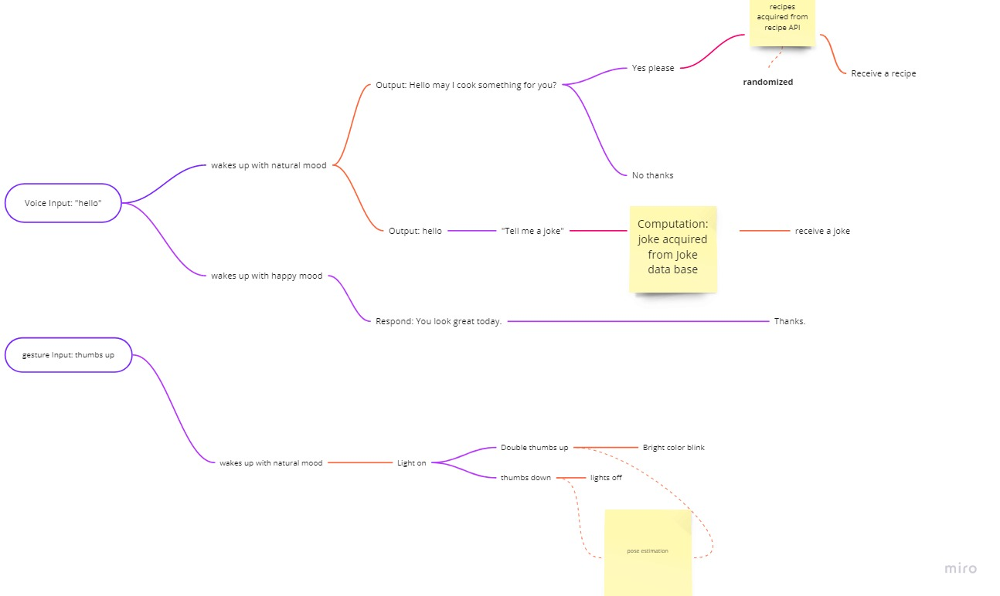

# The Light Bot
I am interested in light and communications. Therefore, I want to make a bot that communicate with human through light. The light will turn on and off in responds to user's voice and physical input. 

## Inputs

Voice is the common source of input such as wake up the bot or sends the commands. I am thinking about using gesture input trained from teachable machine as my second input. THose gestures including something like thumb's up and down, confused face, and arm gestures. 

## Outputs

Outputs will be interaction on screen and some interaction on the light controlled by arduino. The light will have on and off and blink functionality. I am think about using colored lights to add more functionalities but I am still experimenting with it. 

## Computation

Voice recognition and pose estimation are the two main computations the bot will make. Speech to text part I have already done in assignment 2. Some of the computations will be very similar. The pose estimation part is a little tricky and I am trying to train the best model possible to make an accurate estimation. 

