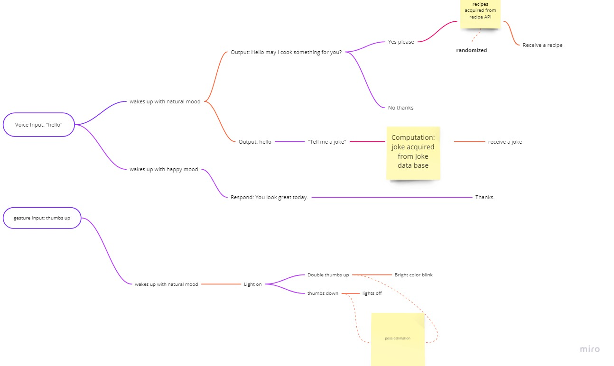

# The Light Bot
I am interested in light and communications. Therefore, I want to make a bot that communicate with human through light. The light will turn on and off in responds to user's voice and physical input. 

## Inputs

Voice is the common source of input such as wake up the bot or sends the commands. I am thinking about using gesture input trained from teachable machine as my second input. THose gestures including something like thumb's up and down, confused face, and arm gestures. 

## Outputs

Outputs will be interaction on screen and some interaction on the light controlled by arduino. The light will have on and off and blink functionality. I am think about using colored lights to add more functionalities but I am still experimenting with it. 

## Computation

Voice recognition and pose estimation are the two main computations the bot will make. Speech to text part I have already done in assignment 2. Some of the computations will be very similar. The pose estimation part is a little tricky and I am trying to train the best model possible to make an accurate estimation. 

## Building the Bot

At first, the vision for this bot is very clear, I first build the serial communication part with p5. But I realized that teachable machine's pose estimation does not have finger pose. Pose estimation works better when people are in a standing position. Since most of us are sitting,  I switch my idea from using the pose to open the light to using clap and knock to open and close the light. I trained a couple of models and got the most accurate one. 

[light video](https://youtu.be/CUO8S9RFmA8)

the communication part of this bot is to mimic a grandmom or mother's personality. She usually asks you if you have had dinner and when you want to cook something, you usually ask them. So this bot will ask you if you want food and pull up a recipe and read the instruction for you. At first, I was trying to use riveScripts but it has importation error when using it together with ml5. Simple communication will show up in the sketch and a full recipe will show at the bottom if the user asked something such as "show recipe".

[communication video](https://youtu.be/aFV3oSev8ig)

## Thoughts 
This project is not easy. I always encounter errors and either from importation, using API and json, or using the model from ml5. Those errors took me a lot of time to figure out. And I want to use rivescript to make the communication more meaningful but I also got blocked. I am satisfied with the result in the end after all the debug sessions. My goal will be to make the bot communicate more like and human and maybe the bot will also have sentiments and feelings. 
