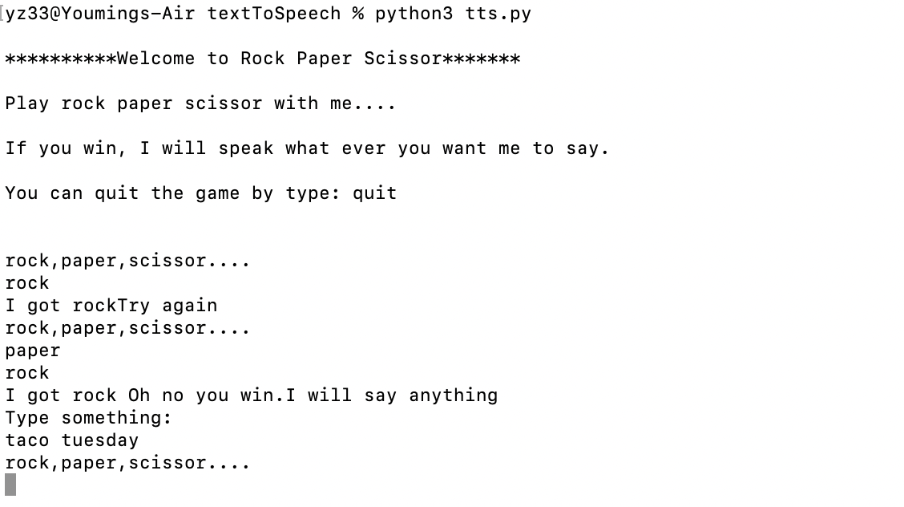

# Text to Speech

This week we explored how text can be translated into speech using the command line, API, and some packages. I tried Waterson assistant by IBM but I always get some audio error which I did not figure out. Then I found filet by CUM is a good one to use for now. 

## Getting Started
Install flite is very simple just follow the steps. I start with some thing straight forward -- just passing command and then the terminal will speak the word I typed:
```python
import os
import sys

def say(something):
    command = "flite \" {0}\" -o test.wav && afplay test.wav".format(something)
    os.system(command)

def main():
    say(sys.argv[1])

if __name__ == "__main__":
    main()
```
flite command had a bug that took me some time to figure out. I to add a space before the " " command otherwise it will throw some error. 

I wonder if I can make this simple program into a rock, scissor, paper game that I can type a command and robot can reply with a win or lose based on his choice.

## Building the Game

It is the game we all played but I want to make tts playful so if the player wins the bot. The player gets the reward to say whatever he typed. Otherwise, the bot will talk some trash to the player.

I made three choices for the bot to choose win, lose, and draw. Bot's choices are weighted. "Lose" will have a higher probability to appear than the other two since I made this bot I can tell him to lose more often.

Here is the game interface in command line:



## Run Python File

Before running python file, we need to install flite. Follow these command:
```bash
git clone http://github.com/festvox/flite
cd flite
./configure
make
make get_voices
```
To run the file just do the following command
```bash
python3 tts.py
```
Everything else will be done while the program is running. 
